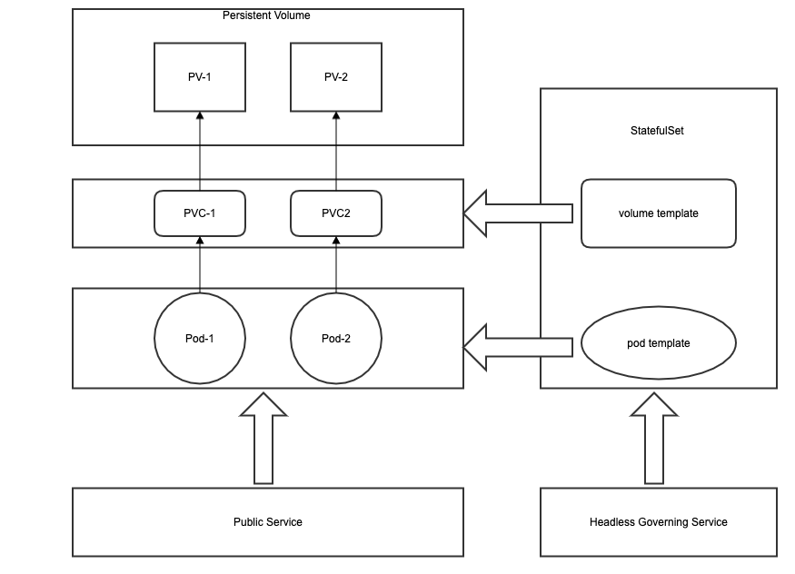

##Summary — StatefulSets: deploying replicated stateful applications

### How to replicate stateful pods?

For example, it is to replicate pods which stand for mysql server and depends on persistent storage. 

<u>What if the storage needs to be distributed among different volumes?</u> 

Solution: (running multiple replicas with separate storage for each)

1. create pods manually? Engineers needs to handle the failure, scaling manually!
2. Use one ReplicaSet for each pod so that the rescheduling of pods can be handled by RS. — Too cumbersome!
3. Each pod use different path under the storage volume. — This has to be cooperative among instances so it is an instance-aware design. 

<u>How to provide a stable identity for each pod?</u> For example, a mysql server should provide stable entries for its replicas. 

Solution: Create a RS for each pod and a Service for each pod and a dedicated Service points to all of the pods. But the pod itself doesn't know what IP it is assigned with. 

### StatefulSets

<u>Pets vs. Cattle analogy</u>: Pods in ReplicaSets or ReplicationController are more like the cattles of a farmer, they are stateless, they can be replaced without notice. However, Pods in StatefulSets are more like pets, they each have a name, they are different from each other, once they are ill, they need to be replaced by another pod with the same identity. 

<u>Pods of StatefulSets have predictable names derived from the ordinal index</u>. 

<u>Rescheduling</u>: When a pod is lost, an identical one should be created. Pods are addressable by their hostname. Just like the pods of RS, which work node they are running on doesn't matter. 

<u>Scalling down</u>: Scalling down a StatefulSets starts with the pod with highest ordinal index and each time it scale down 1 instance. and Scalling down is not permitted if any of the pods are unhealthy. 

<u>Provide dedicated storage for each pod</u>: StatefulSets can have one or more volumes templates. Scalling down won't delete the PV to avoid catastrophic result. Deleting the PVC requires manual operation. 

<u>At-most-one semantics</u>: At most one pod is bounded to one PVC.

### Building a stateful application

### Discovering peers

Why to discover the peer pods? Communication like data synchronization, heartbeats, etc. 

Using SRV: look up the srv via service name(local dns). 

### Dealing with failure

deals with crashed node, node deletion.

