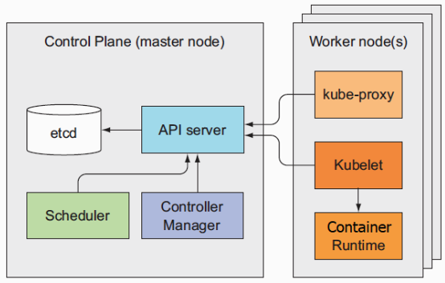

## Understanding Kubernetes internals

### Architecture of Kubernetes Cluster

It consists of Control Plane and the worker nodes. 

Control Plane consists of following components:

* Etcd distributed persistent storage. (storing all the *resources* of the clusters)
* The API server. (This is the only component that controller manager and schedule communicate with)
* The Scheduler which schedules the pods with nodes.
* The Controller Manager which manages all of the controller instances(ReplicationController, ReplicaSet, Deployment, Service, etc).

Components running on the worker nodes:

* The Kubelet — running everything on the worker node. it is also the component that runs the container liveness probes, restarting containers when the probes fail. terminate the pod. 
* The Kubernetes Service Proxy — let the pod talk to service. iptables.  
* The Container Runtime — docker, rkt … 

Other Add-on components:

* DNS server
* Dashboard
* An Ingress controller(reverse proxy)
* Heapster
* The Container Network Interface plugin

<u>How to ensure the consistency of etcd?</u>

etcd uses the RAFT consensus algorithm to achieve consistency. Each node's status is either the current status agreed by the majority of the nodes or the one of the previously agreed upon states. 

The nodes with older states can recover from the other nodes. Since all of the nodes are in current state or older states but not a wrong state, and the controllers listen to the state changes and react to the changes, recovery can be followed by recovering the state of node(etcd), publishing the changes to the controller managers. 

optimistic concurrency control (lock-free)  

<u>What API server does?</u>

* Authentication
* Authorization
* Admission (determine whether the resource is valid and the cluster can offer resource for it.)

They all can consist of different plugins in order to perform different tasks. 

* Notifying clients of resource changes. Different clients listen to different kinds of changes. For example, the RC listen to the pod creation, destroy and the Kubelet listens to the pod scheduling event. 

<u>Scheduler</u>

*  Filter the nodes by the manifest of the resource (11.1.5)
* Prioritize the nodes by the policy. 

<u>Controller Manager</u>

​	Each has a reconcilation loop which handle the difference between current state and the desired state and write the new actual state. They are independent to each other(Good example of asynchronous design since to run a cluster a lot of components are involved. It is complicated to handle all the components as a very clarified flow, decoupling the components)

​	For more detailed information about the responsibility of each controller, refer to 11.1.6.

* Replication Manager (a controller for ReplicationController resources)
* ReplicaSet, DaemonSet, and Job controllers
* Deployment controller
* StatefulSet controller
* Node controller
* Service controller
* Endpoints controller
* Namespace controller
* PersistentVolume controller
* Others

### How controller cooperate?

All together: events are chained. On one hand, some components listen to some events (changing), on the other hand, after dealing with the event, the components produce new events which are listened by other components. 

### Running pod

pause container in each pod holds all the containers of a pod(network, Linux namespace). 

### Inter-pod networking

No NAT(network address translation). Much like a local Area Network which contains some switches, subnetting rules. Each node is assigned with a range of network IP and each pod can have a unique IP address from that range. There is a software-defined network which understands the topology of the nodes, intercepts the inter-pod packet and redirects the packet towards its destination. 

### The implementation of Services

Via kube proxy (reverse proxy). 

When a Service is created, a virtual IP and port are assigned to that service and the pair of IP and port is notified by all of the nodes so that they can update the kernel iptables. When a request is made to that service, the kube proxy intercepts that package and find out that there is a match in the iptables with the destination. So it randomly selects one pod and change the destination to the pod's IP and port. 

### Availablity 

Deploy serveral copies(masters) of the system and use leader election to choose a working copy and stand-by copies. 

 