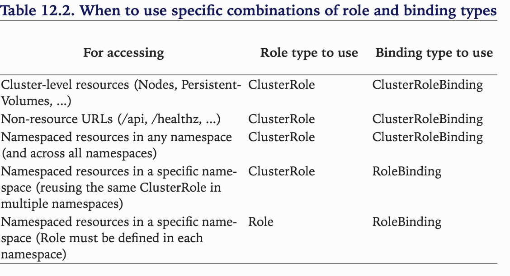

## Summary — Securing the Kubernetes API server

### Authentication of Kubernetes

What does authentication plugins of kubernetes do? — Extract the information of request like username/userID, group the user is in, that is authentication determines who is making the request.

<u>Users:</u> 

* humans (SSO)
* Pods (Service Account)

Since users can come from different entities, so different authentication plugins are invented to extract user information in different ways.

Here we focus on the authentication of Pods which is authenticated via **service account(SA)**. 

Service Account is mounted as secret volume in file /var/run/secrets/kubernetes.io/serviceaccount/token.

SA can be assigned to pods by describing serviceAccountName in the pod specification.

### Securing the cluster with role-based access control

Authorization with RBAC.

Kubernetes manages the access-control in terms of verbs(actions) and nouns(resources). Verbs includes "get", "create", "update", etc. Nouns includes "pod", "rc", "service", ect.  

Define a role with what actions the role can play on the resources, then make a binding between the role and the SA. 

Two types of roles are introduced into Kubernetes:

* Cluster Role — (used to define cluster level role to manage the access control to cluster level resources like PersistentVolume)
* Role (based on namespace)

Two types of bindings: 

* ClusterBinding
* Binding

Creating specific ServiceAccounts for each pod

Expecting your apps to be compromised
