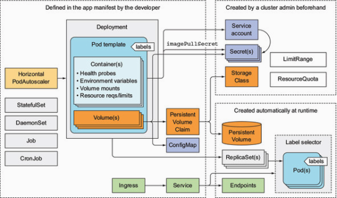

## Best practices for developing apps

Putting all the resources in an application together:

* Lables: All of the resources can have lables to keep them organized.

* Annotations: Description of the resources.

Pods's Lifecycles:

* A pod must expect to be killed and relocated.
  * Expecting the local IP address and hostname to change: developpers should never base membership in a clustered app on the member’s IP address, and if basing it on the hostname, should always use a StatefulSet
  * Use a persistent volume for pod restarts but be careful that corrupted data can cause repetitive crashes(CrashLoopBackOff).
* The partially dead pod is not rescheduled.  It just waits for it to recover, since the rationale is moving the pod to another node won't fix the problems.
* Starting pods in a specific order:
  * Order of app deploying can not be guaranteed, all actions are taken asynchronously. 
  * But using an init container can suggests the Kubernetes cluster to check the precondition before deploying the pod.
  * it’s much better to write apps that don’t require every service they rely on to be ready before the app starts up.
* Lifecycle hooks: similar to liveness probes and readiness probes
  * Forms: Command or HTTP get request
  * Post-start hook: allow you to run additional commands without having to touch the app. The hook is run in parallel with the main process. If the hook fails, the main container will be killed.
  * Pre-stop hook: is executed immediately before a container is terminated. The container is terminated no matter what status code the hook returns. The hooks give limited time to the containers to have graceful shutdown.
  * What if the shutdown time is not predictable? Use dedicated shutdown pods.

Ensure all clients requests are handled properly:

This would be a problem when container is being killed since removing pod from the endpoint and shutting down the pod happen in parallel. The end result is that the pod may still receive client requests after it was sent the termination signal.

Solution: handle the requests properly after it receives the SIGTERM. Stop to accepts new requests after a period of time; Wait until the active requests finish and then shut down completely.

Tips on management of pods in Kubernetes:

* Use proper tags on the image and set proper Image pulling policy.
  * Never use "latest" tag: yes, rescheduling! 
  * Use multi-dimensional lables on resources
  * Describe the resources with annotations. 
  * Write out information for the reasons why the container is shutted down.
  * Output logs to a centrialized repository(Fluentd). 