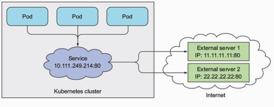

## Chapter 5 Summary —  Services: enabling clients to discover and talk to pods

### Introduction

#### Explanation

- Services — an abstraction representing functionality a groups of pods provide and it is found by other services. “A Kubernetes Service is a resource you create to make a single, constant point of entry to a group of pods providing the same service”

- Useful commands:

  > kubectl exec <pod_id> -- command <options>...

- Configure the pods with SessionAffinity: since Kubernetes works on TCP or UDP packets, they can't extract the cookie inside the payload which is an HTTP packet. So it offers the sessionAffinity option on IP level. 
- Service can be set up to have multiple ports. To do that, name the ports with different names. But it requires the application to have the ability to listen to multiple ports. 

#### Discover the service

- By environment variables: If the pods are created after the service which stands for a constant entry for some pods, is created, the IP addresses and ports of all services are set as the environment variables inside each container. Use the commands: 

  > kubectl exec <pod_id> env 

- DNS: eg. http://kubia.default.svc.cluster.local

### Connecting the Service living outside the cluster

#### Endpoints

resource that sits between service and pods. A list of IPs and Ports exposing the service. 

how many resources that have been seen now? — pods, ReplicationController(replicaSet, DaemonSet, Job .. ), endpoints, service. 

decoupling the endpoints from the service resource enable the manual configuration of endpoints:



Note: endpoint is not an attribution of Service and this is shown in the diagram. Within the Kubernetes cluster, service is binded with an internal IP and a port number. When a HTTP request is made from one pod to another pod, the request is captured by the cluster and redirect directly to the pod without going out of the cluster. However, endpoint serves as a bridge between the cluster and external service sitting between service and clients who make the requests. 

### Exposing Service to External Clients

Three ways to do it:

1. NodePort: creating a service and setting its type to NodePort.
2. LoadBalancer: extension of NodePort (do it on GKE)
3. Ingress Resource (next section)

1 and 2 are binding the exposed functionality on the service. 

### Ingress Resource

The act of going in or entering; the right to enter; a means or place of entering. Multiple services can be exposed through a single ingress.  

Ingress operates at application layer(HTTP) and can provide cookie-based client affinity. (So this means Kubernetes has the ability to manage session)

```yaml
apiVersion: extensions/v1beta1
kind: Ingress
metadata:
  name: kubia
spec:
  rules:
  - host: xxkubia656.example.com
    http:
      paths:
      - path: /
        backend:
          serviceName: kubia-nodeport
          servicePort: 80
  - (another rule for another service)
```

Ingress can also deal with TLS: 

1. Create tls private key
2. Create tls public key 
3. Sign a certificate with kubectl 
4. Configure the Ingress with tls attribution 
5. Apply the update of configuration to the ingress.

### Signaling when the pods are ready

**Readiness probe** specified by the application itself.

Readiness probe is performed mostly when starting up the pod but it is also useful after the creation of container: Since it signals whether the the application is ready for the traffic or not, it happens to become not ready when some event take place(e.g some depended component is restarted). This probe can remove the pod from the service and prevent traffic from being redirected to not ready pods. 

### Using a headless service for discovering individual pods

Connect to all of the pods of a service with a Kubernetes-Agnotics way(no Kubernetes API).

Kubernetes allows clients to discover pod IPs through DNS lookups.

#### DNS Lookup

Use the tutum/dnsutils container image to perform DNS lookup.

> kubectl run dnsutils --image=tutum/dnsutils --generator=run-pod/v1 --command -- sleep infinity

This commands create a pod running the image dnsutils binary without creating a ReplicationController. 

> kubectl exec dnsutils nslookup kubia-headless
>
> kubectl exec dnsutils nslookup kubia