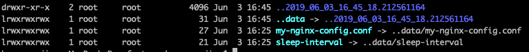

## Chapter 7 Summary — ConfigMaps and Secrets: configuring applications

Preword: two ways to pass configurations to the containerized applications: through configuration file or environmental variables.  But the latter one is more popular because the configuration must either be 

1. baked into the image, which makes the secret exposes to everyone and changing the configuration leads to rebuilding the image, 
2. or through volume but it requires the volume is written before the container is started. 

A better way to do it is to use a top-level Kubernetes resource called **ConfigMap** to manage the configuration. 

### Passing command-line arugments to the containers 

Example: fortuneloop.sh

In this example, we add the entry point with command-line argument $1 to represent the sleeping interval of the script. 

**Note**: An error I met with was when typing: 

> docker run -it docker.io/kuangwanjing/fortune:args

It failed: 

> docker: Error response from daemon: OCI runtime create failed: container_linux.go:344: starting container process caused "exec: \"/bin/fortuneloop.sh\": permission denied": unknown.

This is because the original fortuneloop.sh doesn't have the execution permission. So to fix it, 

> chmod +x fortuneloop.sh

Then rebuild the image and push it to the repository again. 

----

When defining the pods, add the following configuration to the pod to change the comman-line arguments: 

> kind: Pod
> spec:
>   containers:
>
>   - image: some/image
>     command: ["/bin/command"]
>     args: ["arg1", "arg2", "arg3"]
>

### Setting environment variables for a container 

Steps:

1. Reprogram the application to read the environment variables from the environment. 
2. Define the enviornment variables in the pod's definition. 

Drawbacks: The enviornment variables are hard-coded into the definition of the pods, which couple the pod with the configuration. This means, different configuration requires different pods. 

Solution: The application get the configuartion through environment variables but the variables of different pods are managed by the ConfigMap resources of Kubernetes. (another example of indirection). 

### Decoupling configuration with a ConfigMap

The model stays the same but the content of the environment variables are managed by the ConfigMap. 

ConfigMap keys must be a valid DNS subdomain

The sources of ConfigMap can come from:

1. a whole directory
2. a file, 
3. another file (but stored under a custom key instead of using the filename as the key)
4. and a literal value.

<u>Question: how to update the config after the pod is created?</u>

Ways to use ConfigMap

- Create single variable. 
- Listing all the environment variables in the defintion is error-prone, Kubernetes helps to import all the varaibles from the map with a specified prefix. 
- It's available to pass the ConfigMap entry as the command-line argument. 
- Using the ConfigMap volume to expose ConfigMap entries as files 

Conclusion: On application level, configuration can be presented as multiple ways like command-line arugments, environment variables, configuration file(Nginx). These are different representations of configuration but content of the configuration should be decouple from the building of the application. Such that, Kubernetes aims to manage the content and express the content in different ways to satisfy different needs of applications. 

---

Mounting the ConfigMap volume to the existing directory of the image hides the existing directory and this can be dangerous to the pod if an important directory is hidden. 

Solution: mounting a file instead of mounting a directory. 

---

Setting the previledges of the volume: defaultMode: "6600"

---

Symbolic link of the configmap volume guarantees the updating of the config files is atomic. 

### Using Secrets to pass sensitive data to containers

Secret Object In Kubernetes: use Secret to store sensitive information which should be visible to certain containers. It is kept in memory and will not be persistent since it needs wipping out the disk after the container is destroyed. 

Three entries are in the secret: 

1. ca
2. Namespace
3. Token

The secret is encoded with Base64. 

Secret is mount as Secret volume and its type is tmpfs, which means it is never persistent. 