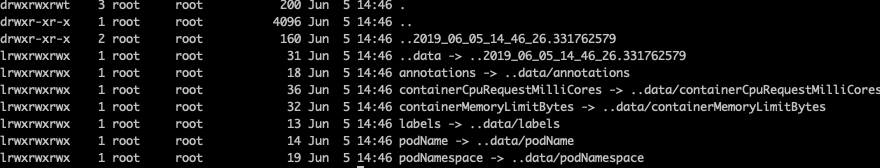

## Summary — Accessing pod metadata and other resources from applications

**Goal: Attain metadata of pod and container, especially those are generated when the pods are starting up with Downward API.**

### Passing the metadata through downwardAPI

1. Exposing the metadata through environment variables:

   Refer to [downward-api-env.yaml](https://github.com/luksa/kubernetes-in-action/blob/master/Chapter08/downward-api-env.yaml) to see how to define the field variables and resource variables.

2. Passing metadata through files in a downwardAPI volume

   This is used to expose the metadata in pod's annotation or labels which can not be exposed through env. Mount the downwardAPI volume and refer to the metadata with relative path. Just like configMap and Secret volume, downwardAPI volume is linked to other directory and updating the metadata is atomic.

   

   The downward API keeps the application Kubernetes-agnostic, since the metadata is exposed as files or environment variables.  

### Talking to the Kubernetes API server

Usage: To attain the most update-to-data data. 

#### Talk to Kubernetes cluster through kubectl proxy command on local machine. 

```shell
> kubectl proxy
Starting to serve on 127.0.0.1:8001 ... 
```

Then make requests to the proxy:

```shell
> curl "http://localhost:8001/apis/batch"
> curl "http://localhost:8001/apis/batch/v1"
{
  "kind": "APIResourceList",
  "apiVersion": "v1",
  "groupVersion": "batch/v1",
  "resources": [
    {
      "name": "jobs",
      "singularName": "",
      "namespaced": true,
      "kind": "Job",
      "verbs": [
        "create",
        "delete",
        "deletecollection",
        "get",
        "list",
        "patch",
        "update",
        "watch"
      ],
      "categories": [
        "all"
      ]
    },
    {
      "name": "jobs/status",
      "singularName": "",
      "namespaced": true,
      "kind": "Job",
      "verbs": [
        "get",
        "patch",
        "update"
      ]
    }
  ]
}
> curl http://localhost:8001/apis/batch/v1/jobs
{
  "kind": "JobList",
  "apiVersion": "batch/v1",
  "metadata": {
    "selfLink": "/apis/batch/v1/jobs",
    "resourceVersion": "3047686"
  },
  "items": []
}
```

#### Talk to API server from a pod 

1. locate the API server

   Within the pod, find the env variable : 

   ```shell
   env | grep KUBERNETES_SERVICE
   curl https://kubernetes # it fails with the security check
   
   ```

2. verify the server's identity

   ```shell
   # curl with the certificate
   curl --cacert /var/run/secrets/kubernetes.io/serviceaccount/ca.crt https://kubernetes
   # set bundle env
   export CURL_CA_BUNDLE=/var/run/secrets/kubernetes.io/serviceaccount/ca.crt
   # and curl
   curl https://kubernetes
   ```

3. Authenticating with the API server

   The token is under /var/run/secrets/kubernetes.io/serviceaccount/token

   ```shell
   curl -H "Authorization: Bearer $TOKEN" https://kubernetes
   # It may need to disable the kubernetes access control by creating a new admin role 
   kubectl create clusterrolebinding permissive-binding   --clusterrole=cluster-admin   --group=system:serviceaccounts
   ```

Too complicated? Use the ambassador proxy!

#### Simplifying API server communication with ambassador containers

build a ambassador container.

then curl "localhost:8001"