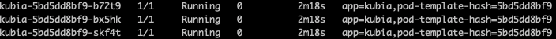

## Summary—Deployments: updating applications declaratively

### How to update the running pods?

Main Question? How to update the pods with newer version of the applications?

Other Question? 

1. Anything about CI/CD? not solved yet. 
2. How to do with the checkpoint?  readiness probe and minReadySeconds 
3. Beta release? gradient release?  learned canary release

With the current knowledge, the way to update the pods with new version app is to:

1. delete all the running pods then start the new ones	
2. or start the new ones and delete all the old ones. 

#### Deleting the old pods and replacing them with new ones

Update the template of the pod, then delete the pods manually and the replicationController or replicaSet would create pods according to new template. But this would lead to a short downtime. 

#### Spinning up the new pods and then deleting the old ones

This requires double of the hardware resources since two sets of pods supporting the service are running. Since it is the Service resource fronts the pods, this means we can deploy a new set of pods controlled by the controller and then redirect the service to the new set of pods by changing the service selector. This is called the **blue-green deployment**. (replace the green one with blue one?)

We can also perform a **rolling update**. Let the service point to both the new ones and olds ones. Initially, scale down the olds ones and scale up the new ones at which the checkout point happens. Then gradually scale down the olds ones to zero pod and totally use the new pods.  (how to perform a rollback in a fast way? updating the service selector!)

###Performing an automatic rolling update with a ReplicationController

Rolling update is relatively safe update but it is laborious to just use kubectl commands(scalling, scalling down, updating the template of pods, setting up the replicaSet, updating the service…). How to do it automatically?

Push the new image with non-existing tag—Set the container’s **imagePullPolicy property to Always** to avoid pushing any changes to the running version of image.  Or always push changes to an image under a new tag.

```shell
kubectl rolling-update kubia-v1 kubia-v2 --image=luksa/kubia:v2
```

What Kubernetes cluster does when it receives such a command is:

1. Re-label the living pods with deployment tag with a value A. 
2. Change the rc(old one) selector to select the pods with both app tag and deployment tag whose value is A. 
3. Create a new rc with deployment tag with a new value B and get the image from v2. 
4. Scale down the old rc and scale up the new rc gradually. 
5. Delete the old rc. 

This ensures no pod runs both the new and old version of the application. 

**Why this is obsolete?**

* Changing the labels of pods out of the maintainers' expectation. 
* It is the kuberctl client to perform the operation — not secure when the network connection is lost … 
* It is imperative not declarative (you tell what you want from kubernetes but not what to do)

### Using Deployments for updating apps declaratively

A Deployment is a higher-level resource meant for deploying applications and updating them declaratively.

Create a Deployment resource with —record option:

```shell
kubectl create -f kubia-deployment-v1.yaml --record
```

The composition of the name of pods generated by Deployment is different from the previous pods: they also contain a numeric number:



And a replicaSet with the same name is generated too:

NAME               DESIRED   CURRENT   READY   AGE
kubia-5bd5dd8bf9   3         3         3       2m1s

This allows Deployment to always use the same ReplicaSet for a given version of pod template since the hash is calculated accoriding to the content of the template. 

Two deployment strategies are supported:

1. Rolling update
2. Recreate

After the update, the old ReplicaSet is still there for rolling back purpose. 

But how to rollback the update?

```shell
kubectl rollout undo deployment kubia
```

Question: this is triggered by the client, but how does the client know it is the right time to undo? how does he know undo does not happen before?

Using the recorder option helps to record all the revision of rs which helps for the rollouts. 

```shell
kubectl rollout history deployment kubia
```

Control the rate of rolling update: maxSurge and maxUnavailable(the minimum number of pods when performing rolling update = replica number - maxUnavailable). 

After fixing the problem, we want to see how the fix works for a small fraction of the users(canary release) 

```shell
kubectl set image deployment kubia nodejs=luksa/kubia:v4
kubectl rollout pause deployment kubia
kubectl rollout resume deployment kubia
```

Introduce readiness probe for the container so that the Deployment can check on the readiness of the pod before killing the old one when updating. 