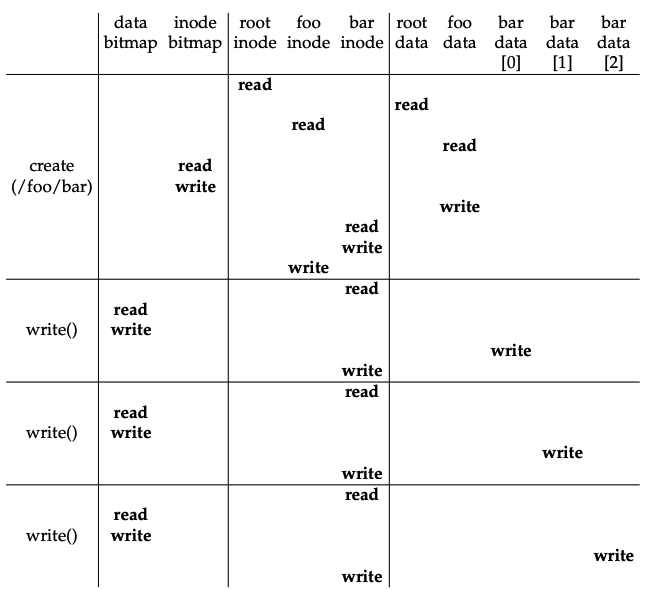

# File System Implementation

This post is about the implmentation of VSFS(very simple file system). This design introduced some
of the basic on-disk structures, access methods, and various policies.

## Overall Organization

The disk layout is divided into fixed-size blocks. Furthermore, the blocks are divided into two groups — one group for data and another group for metadata.

On-disk data:

* Super block: the overall information about the file system about inodes, data blocks, etc.
* Inode bit map: denoting whether a particular inode is used or not.
* Data bit map: denoting whether a data block is used or not.
* Inode table
* Data blocks

## Inode

How can OS know which blocks a file(directory) is using? Three ways to do that: 

BitMap: For each file, it maintains a large bit map with each entry representing whether that block belongs to the file. This method is good at random access but it takes too much space for the storage.

LinkedList: For each file, it maintains a linked list linking every block that belongs to the file. It is not good at random access but it save space for storage.

Inode: To take the advantages of both BitMap and LinkedList and avoid their disadvantages, Inode is invented. Each inode is a pointer which points to either another inode or a block. For each file, FS maintains a list of inodes it has. Since for a lot of files, they are not so big that a few inodes are enough to index the blocks, this method saves storage for the metadata(even though the file is very large, multi-level inodes are enough for them). On the other hand, the indirection is limited to 2 - 3 times according to the system design, it makes a good tradeoff between access time and storage.

*inode - i-number*

What is in the inode?

* block position
* protection information

Multi-level inode: this is an imbalanced tree which reflects the reality that most files are small!

## Directory Organization

Higher level than file. 

Dot - the current directory

Dot-dot - the parent directory

For a directory(a special file), the data region store the metadata of the subdirectories or files under it including inode, strlen, etc. (Why there is some duplication data? It helps to access the directories and files quickly as well as checking the integrity of a fs)

Any files under a directory is like linked to the directory. (That is why deleting a file under a directory calls unlink system API).

## Access Path

access path for read of /foo/bar:

Read root inode for the root data block;

Read root data for foo inode;

Read foo inode for foo data block;

Read foo data block for bar inode;

Read bar inode for bar data block;

Read the first block of bar and write the last access time for this inode.

Read the second block of bar and write the last access time for this inode.

Read the third block of bar and write the last access time for this inode.

Similarly, the access path for a write a /foo/bar would be:

The same things happen for finding the data block of /foo;

Find an empty inode in the inode bitmap for bar and modify the status for that inode. 

Write that inode into the foo data block. 

Read the inode of bar and write the last access time of bar inode.

Write the last modified time for foo inode.

Do the following for three times:

​	Search an empty data block for bar in the data bit map and update the data bit map. 

​	Read the inode of bar, and write the data to its data block. 

​	Update the last modified time of bar inode.

## Problem from the access path

Too many read and write for a single read request or write request, especially on the metadata.

Solution to fix the problems:

1. For read: Use Cache to avoid similar read workload.
2. For write: Use batch write instead of writing through to the disk everytime for the write request.

