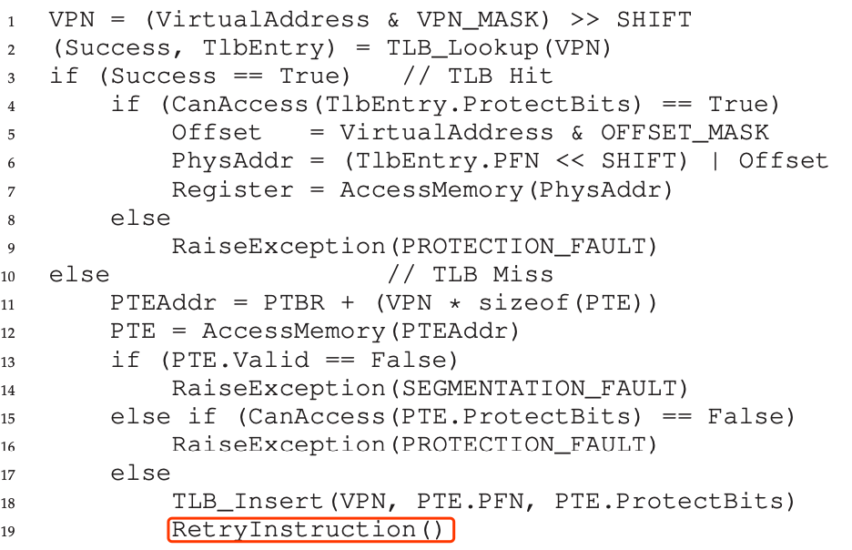

## Memory

### Memory Virtualization

With the address space of the operating system, how to provide an illusion for each process that they own an independent address space? 

Address space is an abstraction representing the memory model of the process. It contains 3 segment — static segment which contains codes, global variable, etc; stack segment which manages the runtime information of the process including local variable, function calls returning address, function arguments, etc; and heap segment which manages the dynamic memory allocation. 

**The goal of memory virtualization** is:

1. Provide this illusion and thus, the program shouldn’t be aware of the fact that memory is virtualized;
2. The mapping from virtual address to physical address should be effective.
3. Protect the OS address space. 

### 1. Address Translation

Goal: attain control(OS protecting itself) and efficiency(with the help of hardware) on memory virtualization. 

Solution: hardware-based address translation. 

Suppose for each process the memory layout is like this:

|	code	|heap —>		(free)			<— stack|

0				2KB 													16KB

which means the process can use up 16KB memory. The OS needs to place this memory layout into some where of the physical memory and relocate the memory with the address referred by the process. 

**Base and Bounds tables:**

The hardware provides two registers base and bound. For each process, the starting address is at 0KB. When the program starts running, OS assign a fixed size memory to it and decide what the base address should assign with the program. 

>  physical address = virtual address + base

This is the primitive of **MMU**. 

Updating the base and bound is a privileged instruction, as well as raising an exception of out-bounded address. 

### 2. Segmentation

Problem: With 1, we place the whole process memory into the physical memory and there is a large chunk of "free" memory of the process occuppying the physical memory, which is a big waste. 

Solution: Divide the process memory into three segments — code, heap and stack and use three pairs of base and bound denoting the physical location of these segments, so that three segments can be placed independently into the physical memory. 

Which segment the va is referring to? Combine the segment information and the offset into the virtual address! E.g:

00 — code

01 — heap

10 — stack

Pseudo code: 

```c
Segment  = (VirtualAddress & SegmentMask) >> SegmentShift;
Offset =  (VirtualAddress & OffsetMask);
if (Offset >= Bounds[Segment]) {
  RaiseException(PROTECTION_FAULT);
} else {
	PhysAddr = Base[Segment] + Offset;
	Register = AccessMemory(PhysAddr);
}
```

Another problem: the stack grows backwards. Extend the information the hardware is holding with extra direction. 

Share the memory among processes. If the segment is read-only, then it is sharable among processes. Add more information to the base-bound tables. And now we will have 4 columns in the table: base, bound, grow positive? and protection. 

### 3. Free Space Management

easy on fixed-size space allocation;

different on variable-size space allocation — external fragmentions occurs when free space is chopped up into smaller fragmentations and can't satisfy the allocation request even the remaining free space is enough. 

Assumption: 

1. malloc and free are the two kernel API on memory. The system must remember the how many bytes an alloction has been assigned with. 
2. focus on the external fragmentation
3. the memory allocation happens in the heap
4. no memory compaction

Low-level mechanism:

1. splitting and coalescing of the free list.
2. tracking the size of allocated region: aside a tiny region remembering the size. A magic number is also used for checking.
3. growing the heap: ask OS for more memory as the heap. 

Strategies:

1. best fit: search for the list to find the smallest region whose size is not smaller than the requested size. Naive implement may have the problem of exhaustion search.
2. worst fit: search for the list to find the largest region whose size is not smaller than the requested size and keep the remaining chunk on the free list. exhaustion on search again. 
3. first fit: address-based ordering
4. next fit: search starts from the position of last allocation. 
5. others: binary buddy-allocation

### 4. Paging

Managing memory in varied size with segmentation has its own difficulty in dealing with fragmentation. What about managing memory in fix-size style? The unit fixed in size is called page. 

Advantages of paging: 

1. it improves the flexibility of using the address space effectively. 
2. Bring up simplicity to manage free space with **inverted page table**.

Problem with page table:  too slow since the page table is in memory and the MMU has to retrieve the page table entry from the memory. too big to store in memory;

### 5. Fixing the first problem — using TLB

Performance bottleneck of using paging is having to retrieve the page number corresponding to every virtual address when translating va to pa. Using TLB (translation-lookaside buffer) to speed up the translation.



From line 3 - 9, the translation look up the PFN in the entries of TLB (which are often a concurrent searching). From line 11 - 17, this is the normal translation retrieving PTE from memory. From 18 - 19, it update the TLB and retries the instructions and the translation goes from the begining till end again. 

The TLB, like all caches, is built on the premise that in the common case, translations are found in the cache(e.g looping the array) — due to spatial locality. Also temporal locality is one reason to adopt this mechanism.

Who is handling the TLB missing event?

1. Hardware
2. Software — OS. When the hardware gets a miss, raises the privilege level into kernel mode and jums to the trap handler. The return-from-trap is different from other traps — it resume the execution of the instruction that causes the trap but not the next instruction like others. <u>Also this takes the risk of infinite loop of translating the address of the miss handle and trapping into the miss handle</u>. To avoid this, the OS can keep the handle in physical memory or setting some entries of TLB to be permanently valid so that the hardware can always find the hit for the handle. 

The TLB is fully-associative — the translation can be anywhere of the TLB.  Searching the entries of the TLB is parallel. 

What about context switch? How to distinguish the entries with the same VPN? Solutions:

1. Flushing the TLB when performing context switch — cost much overhead when OS is performing frequent context switch. (Also the context switch has couple with the address translation)
2. Use an identifier to pointout the process for which the VPN represents (ASID)

What about page sharing ? The same physical page is mapped to different virtual pages by processes and occupies more than one entries. 

Replacement Policy: LRU or random policy

### 6. Fixing the second problem — using a smaller page table

Solution 1: Bigger page? — No because of internal fragmentation

Solution 2: Hybrid of Paging and Segmentation but still many entries remain unused. 

Solution 3: Multi-level Paging — page directory. Divide the page table furthermore to minimize the "internal fragmentation" of the page table. time-space tradeoff between translation time and occupying memory space.

Solution 4: Inverted Page Table — a table where each entry represents a page in physical memory and contains the correpsonding virtual page number. It requires a hash table to speed up the search for the physical page. 


### 7. Swapping


  

